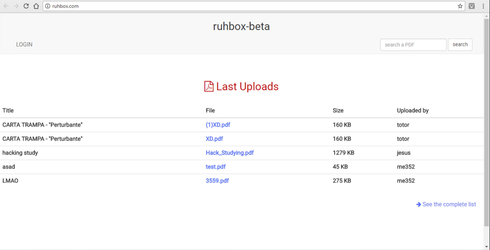
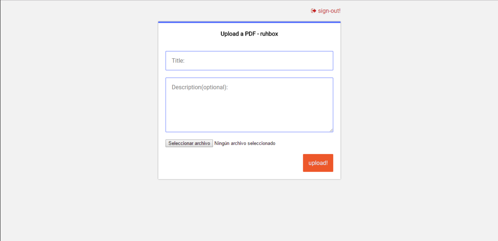

# 📦 ruhbox.com : A PDF sharing website
My first web project, created in 2017. The website allows users to share their PDF files on a public dashboard that can be accessed by anyone visiting the site.  The website had a simple and intuitive design, making it easy for users to navigate and use. It was a challenging project as I had to learn various skills, including server-side scripting, database management, and web design. However, the final product was a prove of my growth as a developer.

## 📸 Screenshots

 ⭐ Main Page 

 ⭐ Upload Form 

